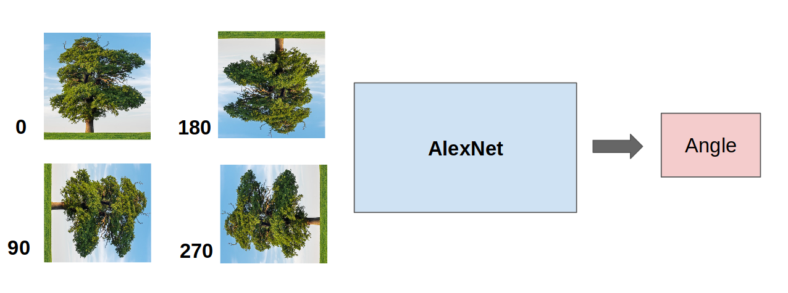
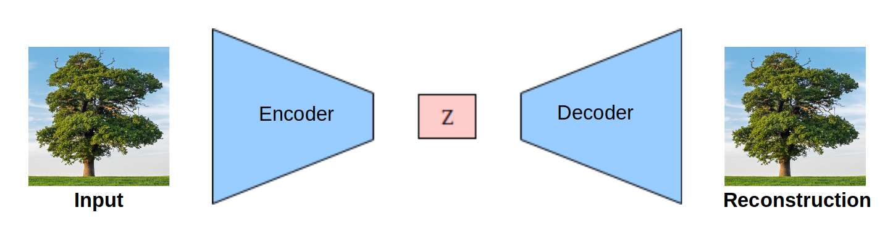
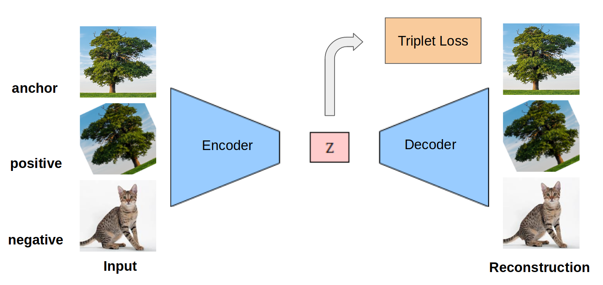
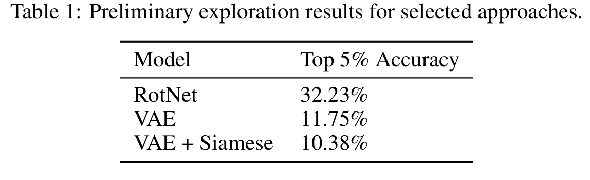
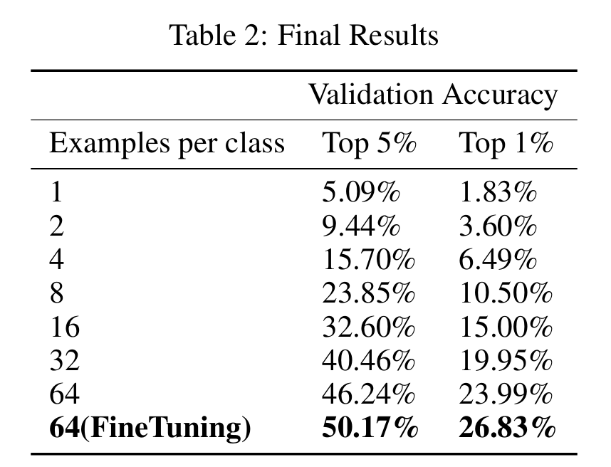
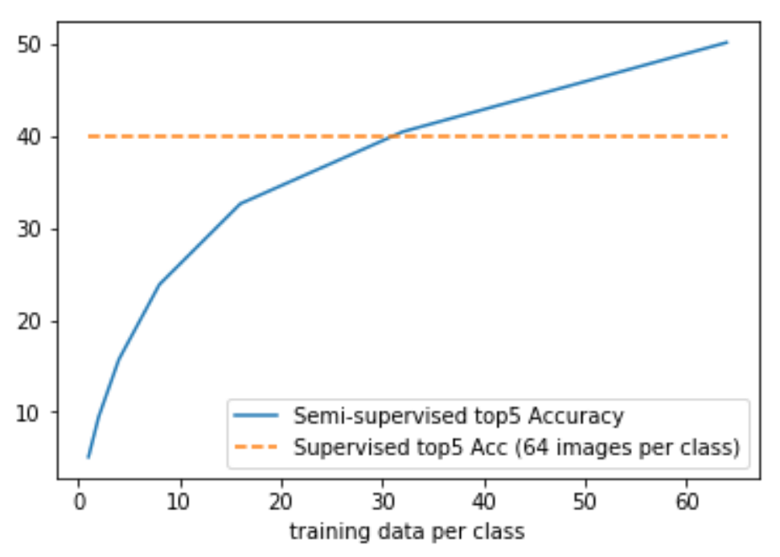

# Semi-Supervised-Image-Classification-with-low-resource-labelled-data

## Team
Urwa Muaz & Shivam Kumar.
Relevant term Paper can be found [here](DeepLearningReport.pdf).

Over-reliance on supervised image tasks leaves us with a dependence on large volumes of human-labeled data, a luxury that is not available across all domains. In contrast, it is comparatively easy to accumulate a large dataset of unlabeled images.  Consequently, to use the unlabeled datasets, it is vital to learn meaningful representation through unsupervised training.  In this study, we evaluate unsupervised training methodologies by analyzing their efficacy in a downstream image classification task with limited labeled data. We try the following unsupervised tasks:

### Rotation Classification
For each image, we produce four rotated copies of the image, and train modified AlexNet to predict the rotation. The four rotations which serve as a supervisory signal are 0,90,180 and 270 degrees. This repo contains the relevant code, codebase was adopted from [here](https://github.com/gidariss/FeatureLearningRotNet).

### Variational Auto Encoder
We use a convolutional version of VAE with the encoder architecture based on AlexNet. The network is trained using a traditional combination of KL loss and reconstruction loss. Code can be found [here](https://github.com/muaz-urwa/Variation-Auto-Encoder-for-Semi-supervised-Image-Classification).

### Siamese Regularized Variational Auto Encoder
We introduce a Variational autoencoder with a siamese triplet loss on the latent space representation. KL loss and reconstruction loss, which are the usual loss terms used to train VAE inspired by the use of Siamese triplet loss for unsupervised learning from videos we decided to experiment this loss term with VAE. Code can be found [here](https://github.com/muaz-urwa/Siamese-Regulated-Convolutional-Variational-Auto-Encoder).

For simplicity and meaningful comparison, we use AlexNet based architecture for all above mentioned three tasks. We trained all the three models for 20 epochs only, which means that this preliminary analysis is not a comprehensive comparison of these approaches. RotNet produces the best results in our exploratory experiments, and thus, we decided to develop our solution upon it. It is interesting to note that VAE performed slightly better than VAE with triplet loss on latent space. However, these preliminary results are far from conclusive, and we think it would be interesting to explore the siamese regularized VAE in more depth.

#### Pretraining
AlexNet was trained for rotation classification using extensive data augmentation for 63 epochs. We used the hyperparameters documented by Rotnet\cite{gidaris2018unsupervised} in their paper. 

#### Classifier Training
Features were extracted from the fourth convolution layer, and three fully connected layers were appended to it. These layers were randomly initialized and trained with a scheduled decreasing learning rate. Early stopping was implemented. We trained seven models, each using a different number of labeled training examples per class. This was done to understand how the size of the training data influences the performance of our semi-supervised setup.

#### Whole Network Fine Tuning:
Eventually, we fine-tuned the network trained on the entire labeled data. Both feature extractor and classifier, which were separately trained before, were fine-tuned together with a small learning rate for 15 epochs. This network was submitted to the competition track.
#### Totally supervised benchmar for this dataset is 40% top5 accuracy.

It is fairly evident that in a scenario when you do not have access to a large number of labelled images, unsupervised pretraining on unlabelled dataset can provide advantage over a fully unsupervised approach. Furthermore, the performance after unsupervised pretraining appears to be reasonably robust and does not decrease dramatically with large decreases in size of labelled data. 

